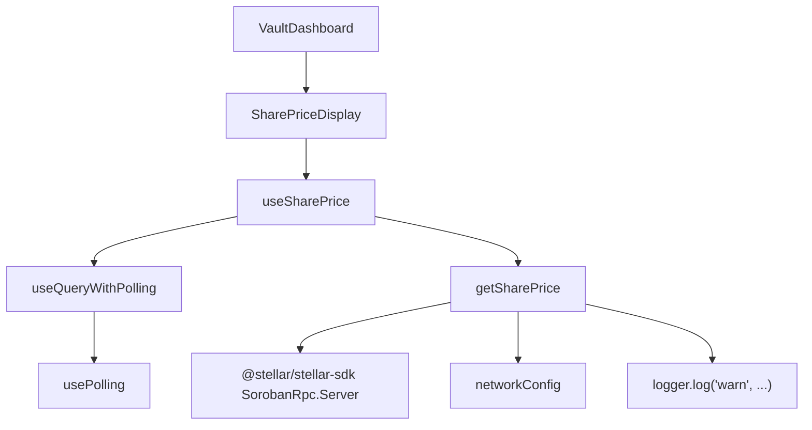
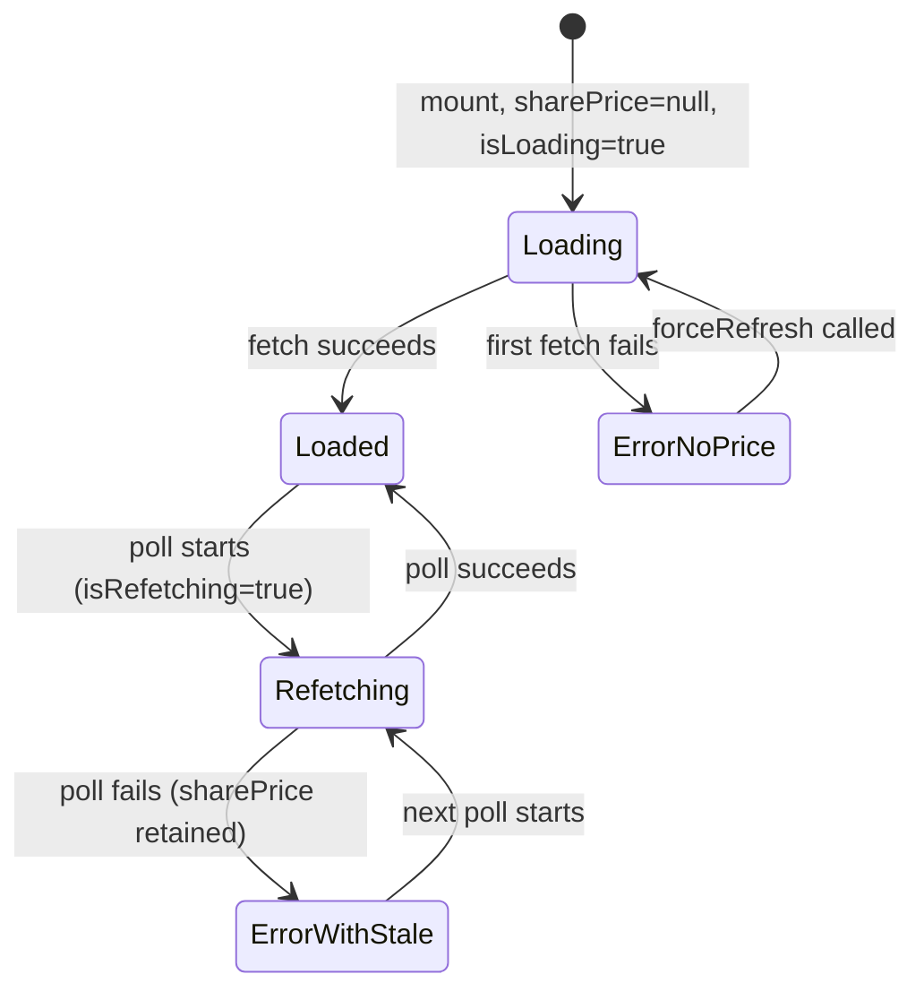

# Design Document: Share Price Display

## Overview

This feature replaces the static `1 yvUSDC = {exchangeRate} USDC` line in `VaultDashboard.tsx` with a live-updating **Share Price Display** widget. The widget reads the authoritative share price directly from the vault's `get_share_price` Soroban contract function, polls it every 30 seconds, and communicates its live-update status through a subtle loading indicator. It degrades gracefully when the RPC is unavailable by retaining the last known (stale) price and surfacing a warning tooltip.

### Key Design Decisions

- **Standalone hook, not in VaultContext**: The share price has its own polling lifecycle (30 s, pauses on hidden/offline) that is independent of the vault summary. Adding it to `VaultContext` would couple two different data sources with different freshness requirements. The `useSharePrice` hook is self-contained.
- **`useQueryWithPolling` over raw `setInterval`**: The existing `useQueryWithPolling` + `usePolling` infrastructure already handles pause-on-hidden, pause-on-offline, and force-refresh. Reusing it avoids duplicating timer logic.
- **`@stellar/stellar-sdk` `SorobanRpc.Server` for contract calls**: The SDK's `simulateTransaction` path is the standard way to call read-only Soroban contract functions without submitting a transaction. This avoids needing a funded account for view calls.
- **`i128` decoded via `BigInt`**: The raw contract return is an `i128` (up to 128-bit signed integer). JavaScript `number` cannot represent all i128 values exactly, but the share price range (1.0 ± small yield) is well within `Number.MAX_SAFE_INTEGER` after dividing by 10¹⁸. We use `BigInt` for the intermediate division to avoid floating-point precision loss.
- **State machine in the component**: The `SharePriceDisplay` component derives its render state from the combination of `{ isLoading, isRefetching, sharePrice, error }` rather than managing its own state, keeping it a pure presentational component.

---

## Architecture

### New Files

| File | Purpose |
|------|---------|
| `frontend/src/hooks/useSharePrice.ts` | React hook — wraps `useQueryWithPolling` to poll `getSharePrice` every 30 s |
| `frontend/src/components/SharePriceDisplay.tsx` | UI component — renders the share price with loading/error states |
| `frontend/src/hooks/useSharePrice.test.ts` | Unit tests for the hook |
| `frontend/src/components/SharePriceDisplay.test.tsx` | Unit tests for the component |
| `frontend/src/lib/vaultApi.test.ts` (additions) | Unit + property tests for `getSharePrice` and the decode function |

### Modified Files

| File | Change |
|------|--------|
| `frontend/src/lib/vaultApi.ts` | Add `getSharePrice(): Promise<number>`, `SharePriceFetchError`, and `decodeSharePrice(raw: bigint): number` |
| `frontend/src/components/VaultDashboard.tsx` | Replace static exchange-rate `<div>` with `<SharePriceDisplay />` |
| `frontend/src/lib/queryClient.ts` | Add `queryKeys.vault.sharePrice()` key |

### Dependency Graph



---

## Components and Interfaces

### `SharePriceFetchError` (in `vaultApi.ts`)

```typescript
export class SharePriceFetchError extends Error {
  constructor(message: string, options?: ErrorOptions) {
    super(message, options);
    this.name = "SharePriceFetchError";
  }
}
```

### `decodeSharePrice(raw: bigint): number` (in `vaultApi.ts`)

Internal helper exported for testing. Converts the raw `i128` contract value to a JavaScript `number`.

```typescript
const FIXED_POINT_DIVISOR = 1_000_000_000_000_000_000n; // 10^18

export function decodeSharePrice(raw: bigint): number {
  // Use BigInt division to preserve precision, then convert to number.
  // Integer part
  const integerPart = raw / FIXED_POINT_DIVISOR;
  // Fractional part: remainder * 10^9 / 10^18 avoids losing sub-cent precision
  const remainder = raw % FIXED_POINT_DIVISOR;
  return Number(integerPart) + Number(remainder) / Number(FIXED_POINT_DIVISOR);
}
```

### `getSharePrice(): Promise<number>` (in `vaultApi.ts`)

```typescript
export async function getSharePrice(): Promise<number>
```

Calls the `get_share_price` view function on the vault contract and returns the decoded price.

### `useSharePrice()` hook (in `useSharePrice.ts`)

```typescript
export interface UseSharePriceResult {
  sharePrice: number | null;
  isLoading: boolean;
  isRefetching: boolean;
  error: Error | null;
  lastUpdated: Date | null;
  forceRefresh: () => void;
}

export function useSharePrice(): UseSharePriceResult
```

### `SharePriceDisplay` component (in `SharePriceDisplay.tsx`)

```typescript
// No props — fully self-contained, reads from useSharePrice()
export const SharePriceDisplay: React.FC
```

---

## Data Models

### Share Price State Machine

The component derives one of five render states from the hook output:



| State | Condition | Rendered |
|-------|-----------|----------|
| `loading` | `isLoading && sharePrice === null` | `<Skeleton width="120px" height="1.25rem" />` |
| `loaded` | `sharePrice !== null && !isRefetching && !error` | Price text only |
| `refetching` | `sharePrice !== null && isRefetching` | Price text + `Loader2` spinner |
| `error-with-stale` | `sharePrice !== null && error !== null` | Price text + `AlertTriangle` + tooltip |
| `error-no-price` | `sharePrice === null && error !== null` | `"Unavailable"` text |

### Query Key

```typescript
// Added to queryKeys in queryClient.ts
sharePrice: () => [...queryKeys.vault.all, "sharePrice"] as const,
```

---

## `getSharePrice` Implementation Detail

The Soroban `get_share_price` function is a read-only view call. The SDK pattern for this is to build a transaction that invokes the contract, then call `simulateTransaction` — which executes the contract in a sandbox and returns the result without broadcasting.

```typescript
import { Contract, SorobanRpc, TransactionBuilder, Networks, BASE_FEE } from "@stellar/stellar-sdk";
import { networkConfig } from "../config/network";
import { log } from "./logger";

const FIXED_POINT_DIVISOR = 1_000_000_000_000_000_000n;

export class SharePriceFetchError extends Error { ... }

export function decodeSharePrice(raw: bigint): number {
  const integerPart = raw / FIXED_POINT_DIVISOR;
  const remainder = raw % FIXED_POINT_DIVISOR;
  return Number(integerPart) + Number(remainder) / Number(FIXED_POINT_DIVISOR);
}

export async function getSharePrice(): Promise<number> {
  if (!networkConfig.contractId) {
    throw new SharePriceFetchError("Vault contract ID is not configured");
  }

  const server = new SorobanRpc.Server(networkConfig.rpcUrl);
  const contract = new Contract(networkConfig.contractId);

  // Build a minimal transaction to simulate the view call.
  // A placeholder source account is used — simulation does not require a funded account.
  const sourceAccount = await server.getAccount("GAAZI4TCR3TY5OJHCTJC2A4QSY6CJWJH5IAJTGKIN2ER7LBNVKOCCWN")
    .catch(() => {
      // Fallback: construct a minimal account object for simulation
      return { accountId: () => "GAAZI4TCR3TY5OJHCTJC2A4QSY6CJWJH5IAJTGKIN2ER7LBNVKOCCWN", sequenceNumber: () => "0", incrementSequenceNumber: () => {} };
    });

  const tx = new TransactionBuilder(sourceAccount as Parameters<typeof TransactionBuilder>[0], {
    fee: BASE_FEE,
    networkPassphrase: networkConfig.networkPassphrase,
  })
    .addOperation(contract.call("get_share_price"))
    .setTimeout(30)
    .build();

  let simResult: SorobanRpc.Api.SimulateTransactionResponse;
  try {
    simResult = await server.simulateTransaction(tx);
  } catch (cause) {
    throw new SharePriceFetchError(
      `RPC call failed: ${cause instanceof Error ? cause.message : String(cause)}`,
      { cause }
    );
  }

  if (SorobanRpc.Api.isSimulationError(simResult)) {
    throw new SharePriceFetchError(`Contract simulation error: ${simResult.error}`, {
      cause: new Error(simResult.error),
    });
  }

  // Extract the i128 return value from the simulation result
  const returnValue = simResult.result?.retval;
  if (!returnValue) {
    throw new SharePriceFetchError("Contract returned no value");
  }

  // The i128 XDR value is accessed via the SDK's scVal helpers
  const raw = returnValue.i128();  // returns { lo: bigint, hi: bigint }
  const rawBigInt = (raw.hi << 64n) | raw.lo;

  return decodeSharePrice(rawBigInt);
}
```

**Note on the placeholder account**: Soroban `simulateTransaction` does not execute on-chain and does not require a funded source account. The SDK requires a valid-format account object to build the transaction envelope, but the simulation ignores the sequence number and fees. Using a well-known testnet account address (the Stellar foundation's testnet faucet) as a placeholder is the standard pattern for view calls.

---

## `useSharePrice` Hook Implementation Detail

```typescript
import { useQuery } from "@tanstack/react-query";
import { useQueryWithPolling, POLLING_INTERVALS } from "./useQueryWithPolling";
import { getSharePrice } from "../lib/vaultApi";
import { queryKeys } from "../lib/queryClient";

export function useSharePrice(): UseSharePriceResult {
  const query = useQuery({
    queryKey: queryKeys.vault.sharePrice(),
    queryFn: getSharePrice,
    staleTime: POLLING_INTERVALS.normal,   // 30 s
    retry: 1,                              // one retry on failure
    refetchOnWindowFocus: false,           // polling handles this
  });

  const { polling, lastUpdated } = useQueryWithPolling(query, {
    interval: POLLING_INTERVALS.normal,    // 30 000 ms
    pauseOnHidden: true,
    pauseOnOffline: true,
  });

  return {
    sharePrice: query.data ?? null,
    isLoading: query.isLoading,
    isRefetching: query.isFetching && !query.isLoading,
    error: query.error,
    lastUpdated,
    forceRefresh: polling.forceRefresh,
  };
}
```

The hook deliberately does **not** log errors itself — error logging is the responsibility of `getSharePrice` (requirement 4.4). This keeps the hook focused on state management.

Wait — re-reading requirement 4.4: "IF a Polling_Cycle fails, THEN THE `useSharePrice` hook SHALL log the error". The logging belongs in the hook, not in `getSharePrice`. The hook uses a `useEffect` watching `query.error` to call `log('warn', ...)` when an error appears.

```typescript
useEffect(() => {
  if (query.error) {
    log("warn", "Share price fetch failed", {
      errorCode: query.error.name,
      message: query.error.message,
      timestamp: new Date().toISOString(),
    });
  }
}, [query.error]);
```

---

## `SharePriceDisplay` Component Implementation Detail

### JSX Structure

```tsx
<div
  role="status"
  aria-live="polite"
  aria-atomic="true"
  style={{ marginTop: "8px", color: "var(--text-secondary)", fontSize: "0.82rem" }}
>
  <span>1 yvUSDC =&nbsp;</span>

  {/* State: loading (no price yet) */}
  {isLoading && sharePrice === null && (
    <Skeleton width="120px" height="1.25rem" />
  )}

  {/* State: error, no stale price */}
  {!isLoading && sharePrice === null && error && (
    <span style={{ color: "var(--text-secondary)" }}>Unavailable</span>
  )}

  {/* State: price available (loaded / refetching / error-with-stale) */}
  {sharePrice !== null && (
    <>
      <span>{sharePrice.toFixed(4)} USDC</span>

      {/* Refetching indicator */}
      {isRefetching && (
        <Loader2
          size={14}
          aria-hidden="true"
          className="spin"
          style={{ marginLeft: "4px", animation: "spin 0.9s linear infinite" }}
        />
      )}

      {/* Stale price warning */}
      {error && !isRefetching && (
        <Tooltip
          content="Share price could not be refreshed. Showing last known value."
          placement="top"
        >
          <AlertTriangle
            size={14}
            aria-label="Share price data may be stale"
            style={{ marginLeft: "4px", color: "var(--text-warning)" }}
          />
        </Tooltip>
      )}
    </>
  )}
</div>
```

### Integration in `VaultDashboard.tsx`

Replace:
```tsx
<div
  style={{
    marginTop: "8px",
    color: "var(--text-secondary)",
    fontSize: "0.82rem",
  }}
>
  1 yvUSDC = {summary.exchangeRate.toFixed(3)} USDC
</div>
```

With:
```tsx
<SharePriceDisplay />
```

The `SharePriceDisplay` component is self-contained and manages its own data fetching via `useSharePrice`. No props are needed.

---

## Correctness Properties

*A property is a characteristic or behavior that should hold true across all valid executions of a system — essentially, a formal statement about what the system should do. Properties serve as the bridge between human-readable specifications and machine-verifiable correctness guarantees.*

### Property Reflection

Before writing properties, reviewing the prework for redundancy:

- **1.2 (decode correctness)** and **6.4 (round-trip)** both test the `decodeSharePrice` function. They are complementary, not redundant: 1.2 tests the forward direction (raw → number), 6.4 tests the round-trip (raw → number → raw). They can be combined into a single comprehensive round-trip property that subsumes both.
- **2.6 (stale price preserved during refetch)** and **2.8 (stale price retained on failure)** both test that `sharePrice` is not cleared. They test different triggers (refetch in progress vs. fetch failure) but the same invariant. They can be combined into one property: "sharePrice is never cleared once set".
- **2.7 (success updates price)** and **4.4 (failure logs warn)** are independent — different behaviors, different inputs.
- **3.1 (price formatting)** and **3.3 (stale price shown during refetch)** are independent — different states.
- **4.2 (stale price shown on error)** overlaps with **2.8** at the hook level but tests the component rendering. Keep as a separate component-level property.

After reflection, the consolidated properties are:

---

### Property 1: Decode round-trip

*For any* `i128` value representable as a JavaScript `number` (i.e., `raw / 10¹⁸ ≤ Number.MAX_SAFE_INTEGER`), decoding and re-encoding the value SHALL produce the original raw value: `BigInt(Math.round(decodeSharePrice(raw) * 1e18)) === raw`.

**Validates: Requirements 1.2, 6.4**

---

### Property 2: RPC errors always produce `SharePriceFetchError`

*For any* error thrown by the Soroban RPC (network errors, timeouts, non-success responses), `getSharePrice` SHALL throw a `SharePriceFetchError` whose `cause` property is the original error.

**Validates: Requirements 1.4**

---

### Property 3: Share price is never cleared once set

*For any* previously fetched share price value, the `useSharePrice` hook SHALL retain that value in `sharePrice` both while a refetch is in progress (`isRefetching === true`) and after a refetch fails (`error !== null`). The `sharePrice` field SHALL only be `null` before the first successful fetch.

**Validates: Requirements 2.6, 2.8**

---

### Property 4: Successful fetch updates price and clears error

*For any* new share price returned by a successful `getSharePrice` call, the `useSharePrice` hook SHALL update `sharePrice` to the new value, set `error` to `null`, and set `lastUpdated` to a `Date` within a few milliseconds of the fetch completing.

**Validates: Requirements 2.7**

---

### Property 5: Price is always formatted to 4 decimal places

*For any* valid share price value (positive finite `number`), the `SharePriceDisplay` component SHALL render a string matching the pattern `{price.toFixed(4)} USDC` — exactly 4 decimal places followed by a space and "USDC".

**Validates: Requirements 3.1**

---

### Property 6: Stale price is always shown with warning icon on error

*For any* share price value that was previously fetched successfully, when the `error` state is active and `isRefetching` is `false`, the `SharePriceDisplay` SHALL render both the formatted price text and the `AlertTriangle` warning icon.

**Validates: Requirements 4.2**

---

### Property 7: Fetch failures are always logged at warn level

*For any* error thrown by `getSharePrice` during a polling cycle, the `useSharePrice` hook SHALL call `log('warn', ...)` with a message that includes the error's message and a timestamp.

**Validates: Requirements 4.4**

---

## Error Handling

| Scenario | Behavior |
|----------|----------|
| `contractId` is empty string | `getSharePrice` throws `SharePriceFetchError("Vault contract ID is not configured")` immediately, no RPC call made |
| RPC network error (fetch fails) | `getSharePrice` catches and re-throws as `SharePriceFetchError` with original error as `cause` |
| Simulation returns error response | `getSharePrice` throws `SharePriceFetchError` with simulation error message |
| Contract returns no value | `getSharePrice` throws `SharePriceFetchError("Contract returned no value")` |
| First fetch fails (no stale price) | `SharePriceDisplay` shows `"Unavailable"` text |
| Subsequent fetch fails (stale price exists) | `SharePriceDisplay` shows stale price + `AlertTriangle` + tooltip |
| Component renders while hook is loading | `SharePriceDisplay` shows `<Skeleton>` |
| Any unhandled error in component | Caught by the state machine logic; component never throws to parent |

All errors from polling cycles are logged via `log('warn', ...)` in the `useSharePrice` hook's `useEffect` watching `query.error`.

---

## Testing Strategy

The project uses **Vitest** + **React Testing Library** for unit tests and **fast-check** for property-based tests. Since `fast-check` is not currently in `package.json`, it will be added as a dev dependency.

### Unit Tests: `getSharePrice` (`vaultApi.test.ts`)

- Correct decoding of a known raw value (e.g., `1_000_000_000_000_000_000n` → `1.0`)
- Correct decoding of a value representing `1.0842` (e.g., `1_084_200_000_000_000_000n`)
- `SharePriceFetchError` thrown when `contractId` is empty (no RPC call made)
- `SharePriceFetchError` thrown when `simulateTransaction` rejects
- `SharePriceFetchError` thrown when simulation returns an error response
- `SharePriceFetchError` cause is the original error

### Property Tests: `decodeSharePrice` (`vaultApi.test.ts`)

Uses `fast-check`. Minimum 100 iterations per property.

- **Property 1**: Round-trip — `BigInt(Math.round(decodeSharePrice(raw) * 1e18)) === raw` for any `raw` in `[0n, BigInt(Number.MAX_SAFE_INTEGER) * FIXED_POINT_DIVISOR]`
  - Tag: `Feature: share-price-display, Property 1: Decode round-trip`

### Unit Tests: `useSharePrice` (`useSharePrice.test.ts`)

Uses `renderHook` from React Testing Library.

- Initial state: `sharePrice === null`, `isLoading === true`, `error === null`
- After successful fetch: `sharePrice` is set, `isLoading === false`, `error === null`, `lastUpdated` is a `Date`
- During refetch: `isRefetching === true`, `sharePrice` retains previous value
- After failed fetch with stale price: `error` is set, `sharePrice` retains previous value
- After failed fetch without stale price: `error` is set, `sharePrice === null`
- `log('warn', ...)` is called when a fetch fails

### Property Tests: `useSharePrice` (`useSharePrice.test.ts`)

- **Property 3**: Stale price never cleared — generate random prices, set as current, trigger failure, verify price unchanged
  - Tag: `Feature: share-price-display, Property 3: Share price is never cleared once set`
- **Property 4**: Success updates price — generate random new prices from mock, verify sharePrice updates
  - Tag: `Feature: share-price-display, Property 4: Successful fetch updates price and clears error`
- **Property 7**: Failures always logged — generate random errors, verify log called with warn
  - Tag: `Feature: share-price-display, Property 7: Fetch failures are always logged at warn level`

### Unit Tests: `SharePriceDisplay` (`SharePriceDisplay.test.tsx`)

- Skeleton rendered when `isLoading=true` and `sharePrice=null`
- Formatted price shown after successful fetch (e.g., `"1.0842 USDC"`)
- `Loader2` spinner present when `isRefetching=true`; absent when `isRefetching=false`
- `AlertTriangle` icon shown when `error` is set and `sharePrice` is not null
- `"Unavailable"` text shown when `error` is set and `sharePrice === null`
- `aria-live="polite"` and `aria-atomic="true"` present on container
- `role="status"` present on container
- `aria-hidden="true"` on `Loader2` icon
- `aria-label="Share price data may be stale"` on `AlertTriangle` icon
- Tooltip text `"Share price could not be refreshed. Showing last known value."` present in error state

### Property Tests: `SharePriceDisplay` (`SharePriceDisplay.test.tsx`)

- **Property 5**: Price formatting — generate random positive numbers, verify rendered text matches `/^\d+\.\d{4} USDC$/`
  - Tag: `Feature: share-price-display, Property 5: Price is always formatted to 4 decimal places`
- **Property 6**: Stale price + warning icon — generate random prices, render with error, verify both price text and AlertTriangle present
  - Tag: `Feature: share-price-display, Property 6: Stale price is always shown with warning icon on error`

### Integration Test: `VaultDashboard.test.tsx`

- `SharePriceDisplay` is rendered in place of the static exchange-rate string
- The static text `"1 yvUSDC = 1.084 USDC"` (old format) is no longer present

### Property Test Configuration

All property tests use `fast-check` with `{ numRuns: 100 }` minimum. Each test is tagged with a comment in the format:
```
// Feature: share-price-display, Property N: <property text>
```
