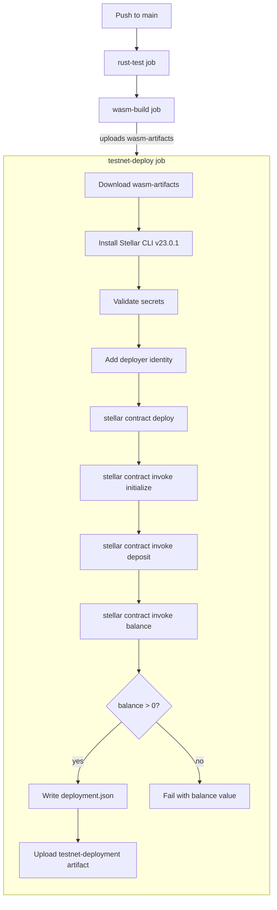

# Design Document: Soroban Testnet CI

## Overview

This feature adds a `testnet-deploy` GitHub Actions job to the existing `rust-wasm.yml` workflow. On every push to `main`, the job downloads the pre-built vault WASM artifact, installs the Stellar CLI, deploys the contract to Stellar testnet, initializes it, runs a smoke test (deposit + balance check), and uploads a `deployment.json` artifact containing the contract address and Git SHA.

The design extends the existing workflow file rather than creating a new one, keeping all contract-related CI in a single place. The new job runs after `wasm-build` succeeds, so it always tests the same binary that passed the unit and WASM build checks.

**Stellar CLI version chosen:** `v23.0.1` — the latest stable release as of the time of this spec. The official GitHub Action (`stellar/stellar-cli@v23.0.1`) is the preferred installation method per [Stellar documentation](https://developers.stellar.org/docs/tools/cli/install-cli).

---

## Architecture



The job is entirely self-contained within GitHub Actions. No external services beyond the Stellar testnet are required. The deployer account is pre-funded on testnet and its secret key is stored as a GitHub Actions secret.

---

## Components and Interfaces

### 1. GitHub Actions Workflow Extension

**File:** `.github/workflows/rust-wasm.yml`

A new job `testnet-deploy` is appended to the existing workflow. It uses `needs: wasm-build` to enforce ordering.

```yaml
testnet-deploy:
  name: Testnet deploy & smoke test
  runs-on: ubuntu-latest
  needs: wasm-build
  steps: [...]
```

### 2. Stellar CLI GitHub Action

**Action:** `stellar/stellar-cli@v23.0.1`

The official action installs the CLI into the runner PATH. This is the preferred method over `curl | sh` because it is pinned, cached, and does not require shell execution of remote scripts.

```yaml
- uses: stellar/stellar-cli@v23.0.1
```

### 3. Deployer Identity Setup

The deployer identity is registered with the Stellar CLI using the secret key from `TESTNET_SECRET_KEY`. The identity is named `ci-deployer` for clarity in CLI invocations.

```bash
stellar keys add ci-deployer --secret-key "$TESTNET_SECRET_KEY"
```

The `TESTNET_SECRET_KEY` value is passed via an environment variable scoped to the step, not interpolated directly into the command string, to prevent accidental log exposure.

### 4. Contract Deployment Script

The deployment sequence runs as a multi-line shell script with `set -euo pipefail` to ensure any failure aborts the job immediately.

```bash
set -euo pipefail

# Deploy
CONTRACT_ID=$(stellar contract deploy \
  --wasm artifacts/wasm/vault.wasm \
  --source ci-deployer \
  --network testnet)

# Initialize
stellar contract invoke \
  --id "$CONTRACT_ID" \
  --source ci-deployer \
  --network testnet \
  -- initialize \
  --admin "$(stellar keys address ci-deployer)" \
  --token "$TESTNET_TOKEN_ADDRESS"

# Smoke test: deposit
stellar contract invoke \
  --id "$CONTRACT_ID" \
  --source ci-deployer \
  --network testnet \
  -- deposit \
  --user "$(stellar keys address ci-deployer)" \
  --amount 1000000

# Smoke test: balance check
BALANCE=$(stellar contract invoke \
  --id "$CONTRACT_ID" \
  --source ci-deployer \
  --network testnet \
  -- balance \
  --user "$(stellar keys address ci-deployer)")

if [ "$BALANCE" -le 0 ]; then
  echo "ERROR: Expected balance > 0, got: $BALANCE"
  exit 1
fi
```

### 5. Deployment Artifact Generation

After a successful smoke test, a `deployment.json` file is written and uploaded as a GitHub Actions artifact.

```bash
GIT_SHA="${{ github.sha }}"
cat > deployment.json <<EOF
{
  "contract_id": "$CONTRACT_ID",
  "git_sha": "$GIT_SHA"
}
EOF
```

The file contains exactly two fields: `contract_id` and `git_sha`. No secret material is written to this file.

```yaml
- uses: actions/upload-artifact@v4
  with:
    name: testnet-deployment
    path: deployment.json
    retention-days: 7
```

### 6. Secret Validation Guard

Before any network operation, the job validates that required secrets are present:

```bash
if [ -z "${TESTNET_SECRET_KEY:-}" ]; then
  echo "ERROR: TESTNET_SECRET_KEY secret is not set or is empty"
  exit 1
fi
if [ -z "${TESTNET_TOKEN_ADDRESS:-}" ]; then
  echo "ERROR: TESTNET_TOKEN_ADDRESS secret is not set or is empty"
  exit 1
fi
```

---

## Data Models

### `deployment.json`

```json
{
  "contract_id": "CXXXXXXXXXXXXXXXXXXXXXXXXXXXXXXXXXXXXXXXXXXXXXXXXXXXXXXXXXXXXXXX",
  "git_sha": "abc1234def5678..."
}
```

| Field | Type | Description |
|---|---|---|
| `contract_id` | string | The Soroban contract address returned by `stellar contract deploy` (C... format, 56 chars) |
| `git_sha` | string | The full 40-character Git commit SHA from `github.sha` |

The file is written only after a successful deployment and smoke test. It is never written if deployment fails before a `CONTRACT_ID` is obtained.

### GitHub Actions Secrets

| Secret Name | Usage | Notes |
|---|---|---|
| `TESTNET_SECRET_KEY` | Deployer account private key | Stellar secret key (S... format). Masked by GitHub Actions automatically. |
| `TESTNET_TOKEN_ADDRESS` | Token contract address for vault initialization | Stellar contract address (C... format). |

### Environment Variables (step-scoped)

| Variable | Source | Purpose |
|---|---|---|
| `TESTNET_SECRET_KEY` | `${{ secrets.TESTNET_SECRET_KEY }}` | Passed to identity setup step only |
| `TESTNET_TOKEN_ADDRESS` | `${{ secrets.TESTNET_TOKEN_ADDRESS }}` | Passed to initialize invocation step |
| `CONTRACT_ID` | Captured from `stellar contract deploy` stdout | Used in all subsequent CLI invocations |

---

## Correctness Properties

*A property is a characteristic or behavior that should hold true across all valid executions of a system — essentially, a formal statement about what the system should do. Properties serve as the bridge between human-readable specifications and machine-verifiable correctness guarantees.*

The prework analysis classified the vast majority of acceptance criteria as SMOKE or INTEGRATION tests (CI configuration checks and external service interactions). These are not suitable for property-based testing.

One area does yield a meaningful property: the `deployment.json` generation logic. This is pure shell/string logic — given a `contract_id` and `git_sha`, produce a JSON document. The behavior varies with input, the logic is entirely within our control, and 100 iterations would catch edge cases (special characters, long strings, empty strings).

**Property Reflection:** Requirements 7.1 and 8.4 both concern the content of `deployment.json`. They can be combined into a single comprehensive property: the generated JSON must contain exactly the two expected fields with the correct values, and must not contain any other fields (which would cover the "no secret key material" constraint).

### Property 1: Deployment JSON round-trip correctness

*For any* valid `contract_id` string and `git_sha` string, the `deployment.json` file generated by the deployment script SHALL be valid JSON that, when parsed, contains exactly the fields `contract_id` and `git_sha` with values equal to the inputs, and no additional fields.

**Validates: Requirements 7.1, 8.4**

---

## Error Handling

| Failure Scenario | Detection | Behavior |
|---|---|---|
| `TESTNET_SECRET_KEY` absent or empty | Guard script before any network call | Exit 1 with descriptive message |
| `TESTNET_TOKEN_ADDRESS` absent or empty | Guard script before any network call | Exit 1 with descriptive message |
| `wasm-artifacts` artifact not available | `actions/download-artifact@v4` built-in failure | Job fails; subsequent steps do not run |
| Stellar CLI installation failure | `stellar/stellar-cli@v23.0.1` action failure | Job fails; subsequent steps do not run |
| `stellar contract deploy` non-zero exit | `set -euo pipefail` | Job fails immediately; no `deployment.json` written |
| `stellar contract invoke initialize` non-zero exit | `set -euo pipefail` | Job fails immediately; no smoke test attempted |
| `stellar contract invoke deposit` non-zero exit | `set -euo pipefail` | Job fails immediately; no balance check attempted |
| `balance` returns 0 or negative | Explicit `if [ "$BALANCE" -le 0 ]` check | Exit 1 with message reporting actual balance value |
| Any other step failure | GitHub Actions default step failure semantics | Job fails; artifact upload step does not run |

The `deployment.json` upload step has no explicit `if:` condition, so it only runs when all preceding steps succeed (GitHub Actions default). This ensures a partial or empty artifact is never uploaded.

---

## Testing Strategy

### PBT Applicability Assessment

This feature is primarily CI infrastructure (YAML configuration + shell scripts). The vast majority of acceptance criteria are SMOKE tests (static YAML configuration checks) or INTEGRATION tests (external Stellar testnet interactions). Property-based testing is not appropriate for these.

The one exception is the `deployment.json` generation logic (Property 1 above), which is pure string/JSON logic suitable for PBT.

### Unit Tests (Shell Script Logic)

These tests validate the shell script logic in isolation, without network access:

1. **Secret guard — empty key**: Run the guard script with `TESTNET_SECRET_KEY=""` and verify it exits non-zero with a message containing "TESTNET_SECRET_KEY".
2. **Secret guard — empty token**: Run the guard script with `TESTNET_TOKEN_ADDRESS=""` and verify it exits non-zero with a message containing "TESTNET_TOKEN_ADDRESS".
3. **Balance assertion — zero balance**: Run the balance assertion script with `BALANCE=0` and verify it exits non-zero and prints the actual value.
4. **Balance assertion — positive balance**: Run the balance assertion script with `BALANCE=1000000` and verify it exits zero.
5. **Contract ID capture**: Run the deploy step with a mock `stellar` binary that prints a known contract ID, verify `CONTRACT_ID` is set correctly.

### Property-Based Test

**Library:** [`proptest`](https://github.com/proptest-rs/proptest) (already a dev-dependency in the vault crate) or a shell-level property test using a simple Bash loop with random inputs.

Since the `deployment.json` generation is a shell `cat` heredoc (not a Rust function), the property test is best implemented as a Bash script that generates random inputs and validates the output:

```bash
# Feature: soroban-testnet-ci, Property 1: deployment JSON round-trip correctness
for i in $(seq 1 100); do
  CONTRACT_ID="C$(head -c 55 /dev/urandom | base64 | tr -dc 'A-Z2-7' | head -c 55)"
  GIT_SHA=$(head -c 20 /dev/urandom | xxd -p)
  
  JSON=$(generate_deployment_json "$CONTRACT_ID" "$GIT_SHA")
  
  # Validate: is valid JSON
  echo "$JSON" | jq . > /dev/null
  
  # Validate: contains exactly the right fields
  PARSED_CONTRACT=$(echo "$JSON" | jq -r '.contract_id')
  PARSED_SHA=$(echo "$JSON" | jq -r '.git_sha')
  FIELD_COUNT=$(echo "$JSON" | jq 'keys | length')
  
  [ "$PARSED_CONTRACT" = "$CONTRACT_ID" ] || exit 1
  [ "$PARSED_SHA" = "$GIT_SHA" ] || exit 1
  [ "$FIELD_COUNT" = "2" ] || exit 1
done
```

Each iteration must run minimum 100 times. The test verifies:
- The output is valid JSON
- `contract_id` equals the input
- `git_sha` equals the input
- Exactly 2 fields exist (no secret key material or other fields)

### Integration Tests (Live Testnet)

The CI job itself is the integration test. A successful CI run on `main` validates:
- Stellar CLI installs correctly
- The vault WASM deploys to testnet
- `initialize` succeeds with the deployer as admin and the token address
- `deposit(1000000)` succeeds
- `balance` returns a value greater than zero

These are verified by the CI run passing end-to-end. No additional integration test harness is needed.

### WASM Path Verification

The existing `wasm-build` job copies artifacts to `artifacts/wasm/`. The vault crate name is `vault` (from `contracts/vault/Cargo.toml`), so the compiled output is `vault.wasm`. The deploy step references `artifacts/wasm/vault.wasm` — this path should be verified in the CI run and can be validated with a `ls -la artifacts/wasm/` step before deployment.
